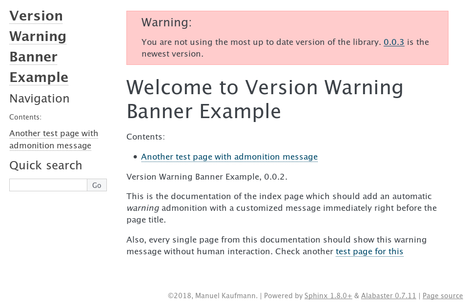

================================
Sphinx Version Warning Extension
================================

Sphinx Version Warning is a Sphinx_ extension that allows you to show a *Warning* banner at the top of your documentation.
The banner is shown based on the version that is displayed compared (using SemVer_) with the latest version on the server.

This extension was originally created to be compatible with `Read the Docs`_ API and currently it's the only backend that supports
(inspired by https://github.com/rtfd/readthedocs.org/issues/3481#issuecomment-378000845)

.. _Sphinx: http://www.sphinx-doc.org/
.. _SemVer: https://semver.org/
.. _Read the Docs: http://readthedocs.org/

How it works?
-------------

When visiting a page in Read the Docs that was built with this extension enabled,
an AJAX request is done to the Read the Docs servers to retrieve all the **active versions** of the project.
These versions are compared against the one that we are reading and if it's an old version,
a *Warning* banner appears at the top of the page.

Examples
--------

There is a live example living at Read the Docs:

- `latest`_ version doesn't show any kind of warning banner
- `0.0.2`_ version shows a warning banner saying that 0.0.3 is available (at the time of writing this docs)
- `0.0.3`_ version doesn't show any banner since it's the latest version (at the time of writing this docs)

.. _latest: https://sphinx-version-warning-example.readthedocs.io/en/latest/
.. _0.0.2: https://sphinx-version-warning-example.readthedocs.io/en/0.0.2/
.. _0.0.3: https://sphinx-version-warning-example.readthedocs.io/en/0.0.3/

Installation
------------

Just run this ``pip`` command insider your virtualenv::

   pip install sphinx-version-warning

Then in your ``conf.py`` you have to add ``versionwarning`` in the ``extensions`` list. Should be similar to::

  extensions = [
      'versionwarning',
  ]

Remember to configure the ``versionwarning_project_version`` and ``versionwarning_project_slug`` of your Sphinx project since it's the key for this to work properly::

  versionwarning_project_version = '0.0.1'
  versionwarning_project_slug = 'sphinx-version-warning'

.. warning::

   If you are building your documentation under Read the Docs,
   ``READTHEDOCS_VERSION`` and ``READTHEDOCS_PROECT`` environment variables will be defined and there is no need to define these variables,
   unless you want to override the default values.

Customization
-------------

Some customization can be done using the ``conf.py`` file of your Sphinx project:

versionwarning_admonition_type (string)
   type of admonition for the banner (warning, admonition or note)

versionwarning_default_message (string)
   default message for the warning banner

versionwarning_messages (dict)
   mapping between versions and messages for its banners

versionwarning_message_placeholder (string)
   text to be replaced by the version number link from the message

versionwarning_project_slug (string)
   slug of the project under Read the Docs (default to ``READTHEDOCS_PROJECT`` environment variable)

versionwarning_project_version (string)
   slug of the version for the current documentation (default to ``READTHEDOCS_VERSION`` environment variable)

versionwarning_api_url (string)
   API URL to retrieve all versions for this project

versionwarning_banner_html (string)
   HTML code used for the banner shown

versionwarning_banner_id_div (string)
   HTML element ID used for the 
 inject as banner

versionwarning_body_selector (string)
   jQuery selector to find the body element in the page and *prepend* the banner

How to contribute?
------------------

Pull Requests are always welcome!

Generate assets
***************

::

    npm install
    ./node_modules/.bin/webpack

Releasing
---------

#. Increment the version in ``versionwarning/__init__.py``
#. Increment the version in ``package.json``
#. Update the ``CHANGELOG.rst``
#. Update ``npm``::

     $ npm update

#. Compile assets::

     $ npm install
     $ ./node_modules/.bin/webpack

#. Commit the changes: ``git commit -m "Release $NEW_VERSION"``
#. Tag the release in git: ``git tag $NEW_VERSION``
#. Push the tag to GitHub: ``git push --tags origin``
#. Upload the package to PyPI::

     $ rm -rf dist/
     $ python setup.py sdist bdist_wheel
     $ twine upload dist/*
