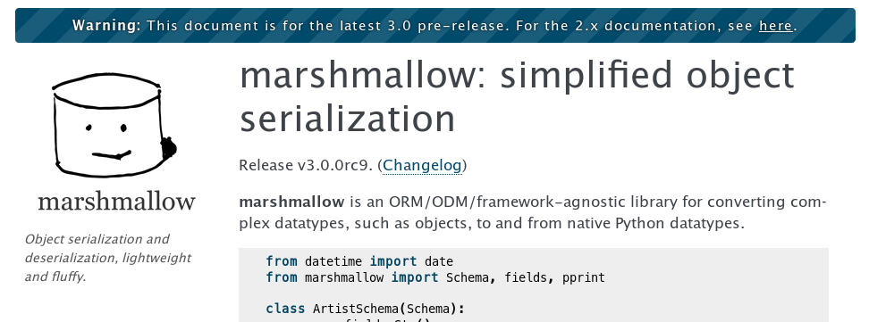
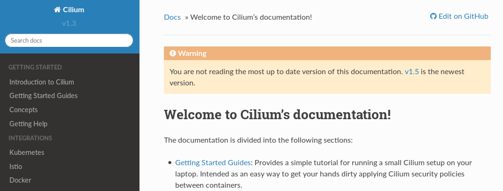

Who Is Using It?
================

These are some projects using this extension
that you can take a look at to understand how they are configured and what's the behavior.

marshmallow
-----------

* https://github.com/marshmallow-code/marshmallow
* `Example URL <https://marshmallow.readthedocs.io/en/3.0/>`__
* `Configuration file <https://github.com/marshmallow-code/marshmallow/blob/dev/docs/conf.py>`__

Cilium
------

* https://github.com/cilium/cilium
* `Example URL <https://docs.cilium.io/en/v1.3/>`__
* `Configuration file <https://github.com/cilium/cilium/blob/master/Documentation/conf.py>`__

